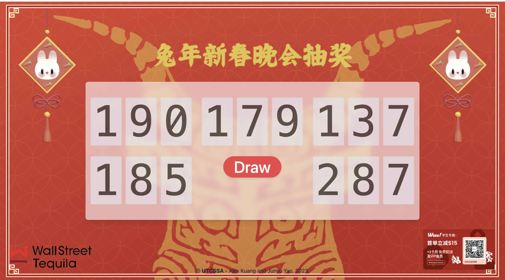

# 晚会抽奖系统

使用 [Nuxt 3](https://nuxt.com/) 搭建。样式使用 [Tailwind CSS](https://tailwindcss.com/) ，动画使用 [GSAP](https://greensock.com/) 。

- [x] 抽奖逻辑
- [x] 抽奖动画
  - [x] 数字变动
  - [x] Confetti? 🎉
  - More...?
- [ ] **TODO** 对接数据库



## Setup

Make sure to install the dependencies:

```bash
# yarn
yarn install

# npm
npm install

# pnpm
pnpm install --shamefully-hoist
```

## Development Server

Start the development server on http://localhost:3000

```bash
npm run dev
```

## Production

Build the application for production:

```bash
npm run build
```

Locally preview production build:

```bash
npm run preview
```

Check out the [deployment documentation](https://nuxt.com/docs/getting-started/deployment) for more information.
